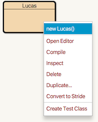

# Objects, Classes, Variables, and Functions

This lesson will cover making objects and classes

# Questions + Notes
## Objects
### 📝 Questions?
*Please handwrite out your answers to these questions. Answer to the best of your ability*
*Make sure to handwrite your answers, you'll learn it faster I promise*
1. What is an object?
2. What is a class?
3. What is a function?
4. What is a variable?
5. How do you initialize a variable in java?
6. In `public static void main(String[] args)` what does each word mean?
7. What is the difference between a static and non-static variable?
8. What is the difference between a static and non-static function?
9. What is a constructor?

### 📖 Intro to Objects?


# Coding
### 🤖 Make an Object!

1. In BlueJ, open the `Intro-To-CS-Study-Guide/1` project
2. create a class called [your name] (make sure the first letter is capitalized)
3. write 3 functions in this class:
```java
    public String getName(){} // this function will return your name.
    public void printName(){} // prints your name
    public String introduce(String otherPersonName){} // returns "Hi [other person's name], I'm [your name]"
```
4. fill in these functions, so that they do the stuff
5. make a java object by right clicking your class<br>

	<br>
give it a name<br>
	<br>
run your functions on the object!<br>
	<br>

6. now make a `Person` class. This class should have one field called name, and a constructor that sets the name
7. Add in all the functions from the [Your Name] class. Rewrite them to work with the `this.name` field
8. Add another `introduce` function, this time it should take the argument `otherPerson` which will have a type of `Person`. This function should introduce `this` person to the other person
<br>Example in the BlueJ codepad:
 ```
>Person adam = new Person("Adam Alan Smith");
>Person lucas = new Person("Lucas");
>adam.introduce(Lucas);
Hi Lucas, I'm Adam Alan Smith 
```
<br>Example with objects:
```	
1. Create a Person object, with a name of instance as adam, and give it the name "Adam"
2. Create a Person object, call it lucas, and give it the name "Lucas"
3. right click on adam, and run the introduce function
4. you should get a terminal pop up that says "Hi Lucas, I'm Adam"
```

